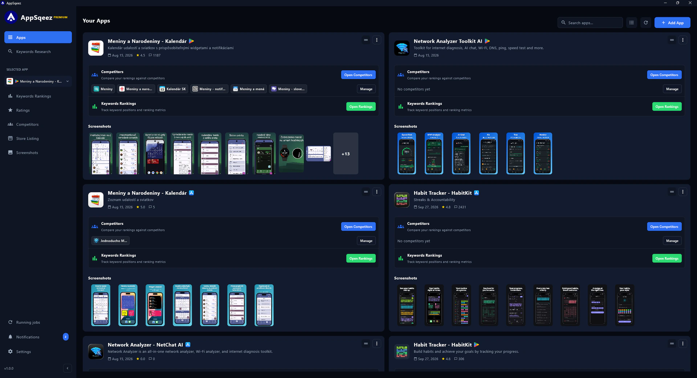
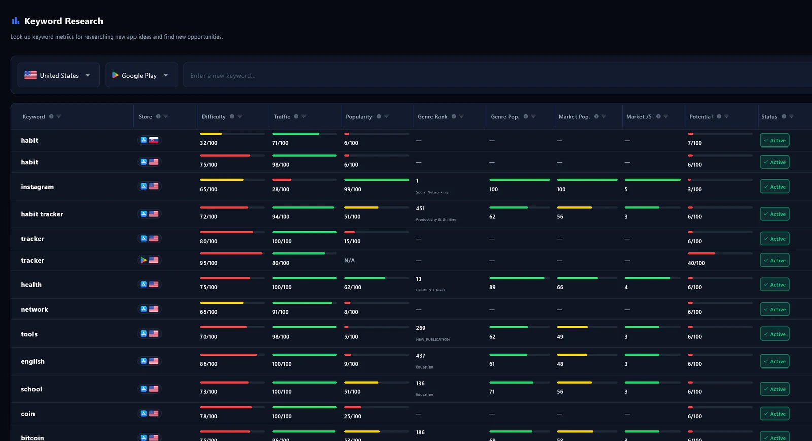
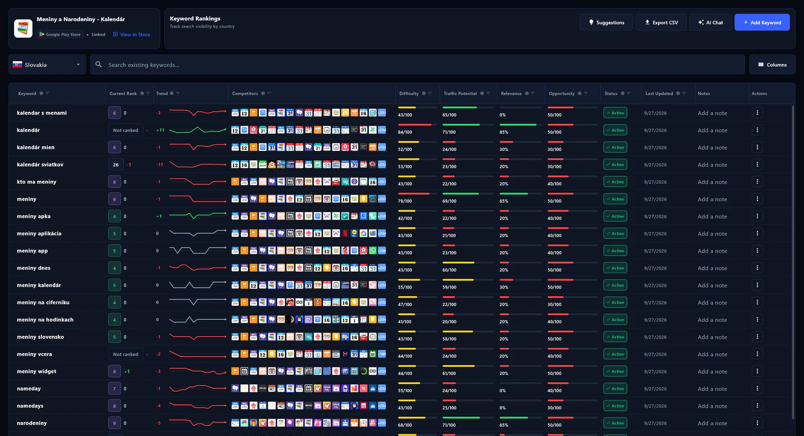
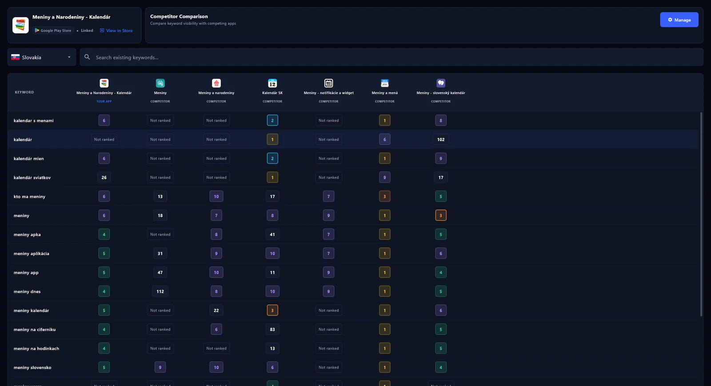
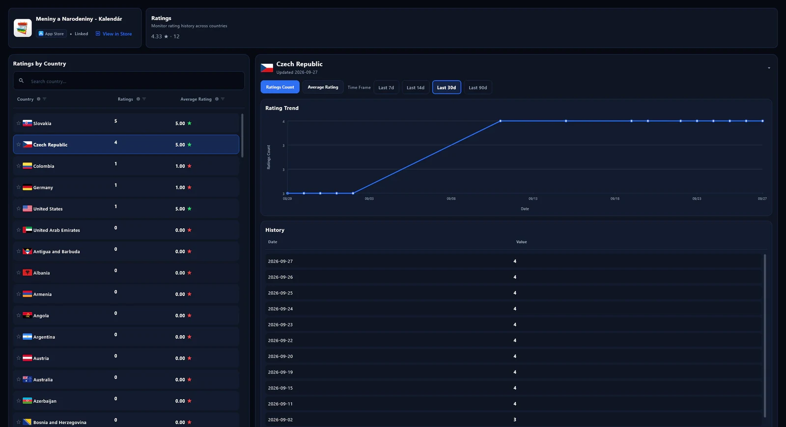
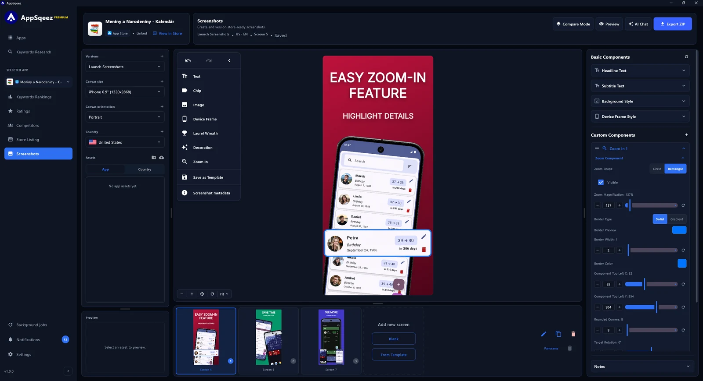
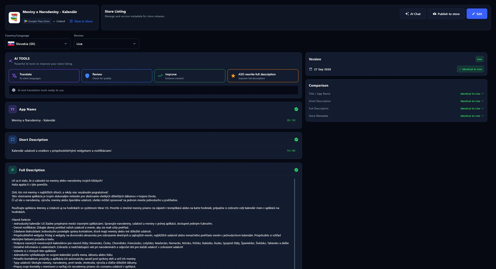

<div align="center">

<a href="https://appsqeez.com"></a>

# AppSqeez Desktop

**Your app store optimization workspace, on your desktop.**

Research keywords, track rankings, compare competitors, and build store listings and screenshots<br>
for the **Apple App Store** and **Google Play** — in one app for Windows, macOS, and Linux.

[](https://github.com/Sqeez-Studio/appsqeez-desktop/releases/latest)
[](https://github.com/Sqeez-Studio/appsqeez-desktop/releases/latest)
[](#download)
[](https://appsqeez.com/features)
[](https://appsqeez.com/features)
[](https://appsqeez.com/pricing)

**[Download](#download)** · [Website](https://appsqeez.com) · [Documentation](https://appsqeez.com/docs) · [Pricing](https://appsqeez.com/pricing) · [Release notes](https://github.com/Sqeez-Studio/appsqeez-desktop/releases)

<a href="https://appsqeez.com/features"></a>

</div>

## Download

<div align="center">

[](https://github.com/Sqeez-Studio/appsqeez-desktop/releases/latest)
&nbsp;
[](https://github.com/Sqeez-Studio/appsqeez-desktop/releases/latest)
&nbsp;
[](https://github.com/Sqeez-Studio/appsqeez-desktop/releases/latest)

</div>

Open the **[latest release](https://github.com/Sqeez-Studio/appsqeez-desktop/releases/latest)**, expand **Assets**, and pick the installer for your operating system:

| Operating system | Installer |
| --- | --- |
| **Windows** | `.msi` |
| **macOS** | `.dmg` |
| **Linux** (Debian / Ubuntu) | `.deb` |

You only need one file. The **Source code** archives that GitHub adds to every release are not app installers.

## What you can do with AppSqeez

<table>
  <tr>
    <td width="50%" valign="top">
      
      <br>
      <b>Find promising keywords</b>
      <br>
      Research difficulty, traffic, and opportunity, with Apple Search Ads popularity for App Store keywords.
    </td>
    <td width="50%" valign="top">
      
      <br>
      <b>Track your rankings</b>
      <br>
      Follow keyword positions over time, see what moved, and export your data to CSV.
    </td>
  </tr>
  <tr>
    <td width="50%" valign="top">
      
      <br>
      <b>Compare competitors</b>
      <br>
      See how your app ranks next to competing apps for the same keywords and countries.
    </td>
    <td width="50%" valign="top">
      
      <br>
      <b>Watch your ratings</b>
      <br>
      Monitor rating counts and averages per country, with history charts.
    </td>
  </tr>
  <tr>
    <td width="50%" valign="top">
      
      <br>
      <b>Design store screenshots</b>
      <br>
      Build screenshots with device frames, backgrounds, text, and zoom callouts, then export them for your listing.
    </td>
    <td width="50%" valign="top">
      
      <br>
      <b>Write and localize listings</b>
      <br>
      Manage versions, check character limits, and prepare metadata for different countries and languages.
    </td>
  </tr>
</table>

- **Work across 150+ countries.** Research and manage your app's presence by store and country.
- **Use your preferred AI provider.** Connect your own API keys or supported local models for help with keywords, listings, and screenshots. AI features require Premium; external providers may charge separately.
- **Keep your work on your machine.** Workspaces, drafts, screenshots, and credentials are stored locally.

See the **[full feature overview](https://appsqeez.com/features)** for details.

## Install

### Windows

1. Download the `.msi` file from the latest release.
2. Open the installer and follow the steps.
3. If Windows SmartScreen warns about the app, choose `More info` and continue only if the file came from this repository.

### macOS

1. Download the `.dmg` file from the latest release.
2. Open the disk image.
3. Drag AppSqeez into Applications if prompted.
4. If macOS blocks the app because it is not notarized yet, open `System Settings > Privacy & Security` and allow the app only if the file came from this repository.

### Linux

Download the `.deb` file from the latest release, then install it with your package manager:

```bash
sudo apt install ./appsqeez*.deb
```

If your shell does not expand the filename, replace `appsqeez*.deb` with the exact downloaded file name.

## Get started

1. **Add your app.** Search for a published app, paste its App Store or Google Play link, or create a draft for an app you haven't launched yet.
2. **Pick a store and country.** Focus your research on the audience you want to reach.
3. **Research keywords.** Explore suggestions and add the keywords you want to track.
4. **Build your store presence.** Use the screenshot and listing tools, then follow your rankings as you refine your strategy.

The **[getting started guide](https://appsqeez.com/docs/getting-started)** walks you through your first workspace.

## Free and Premium

**Start with the free plan — no credit card required.** Try AppSqeez with one app, limited keyword research and tracking, and watermarked screenshot exports.

Premium unlocks unlimited apps and tracked keywords, additional competitor tracking, listing editing, watermark-free screenshot exports, AI features, and background jobs.

See **[current pricing](https://appsqeez.com/pricing)** for the full Free vs Premium comparison. Already have a license? Open **Settings > License** in AppSqeez, paste your license key, and activate it.

## Updates

AppSqeez Desktop checks this repository's latest GitHub Release when it starts.

On Windows, macOS, and Linux, you can also check manually in **Settings > About > Check for updates**. When a newer version is available, the dialog lists the installer for your operating system and lets you open the GitHub Release page. Windows updates use the `.msi` installer from GitHub Releases.

When a newer version is available, the app shows:

- a desktop notification,
- an in-app update toast,
- an item in the app's Notifications screen.

Updates are not installed automatically. Download the new installer from the latest release and run it manually.

Each release contains installer assets and a short version note. See **[all releases](https://github.com/Sqeez-Studio/appsqeez-desktop/releases)** for earlier versions.

## Security

Download AppSqeez only from this repository unless Sqeez Studio publishes another official channel.

This release repository may contain unsigned installers during early distribution. Operating systems can show warnings for unsigned desktop apps even when the file is legitimate. If the warning appears, verify that:

- the installer was downloaded from `Sqeez-Studio/appsqeez-desktop`,
- the version matches the latest GitHub Release,
- the filename extension matches your operating system.

## Help and feedback

- **Guides:** [AppSqeez documentation](https://appsqeez.com/docs)
- **Installation help:** [Download and install guide](https://appsqeez.com/docs/installing)
- **Licenses and billing:** [Premium and licensing](https://appsqeez.com/docs/licensing)
- **Support and bug reports:** [support@appsqeez.com](mailto:support@appsqeez.com)

When reporting a problem, include your AppSqeez version, operating system, what you were trying to do, and any error message. Remove license keys, API keys, and other private information from screenshots before sharing them.

---

<div align="center">

This repository hosts AppSqeez Desktop installers and release notes only.

[AppSqeez](https://appsqeez.com) · [Privacy Policy](https://appsqeez.com/privacy) · [Terms of Service](https://appsqeez.com/terms)

</div>
